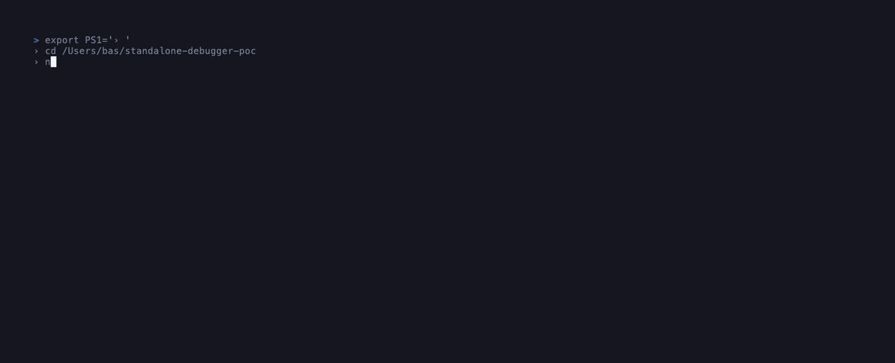

<div align="center">

# dbg

**Standalone, editor-agnostic debugger for the terminal.**  
Breakpoints · Stepping · Variable inspection · Process attach — without an IDE.

[](https://github.com/basvandriel/standalone-debugger-poc/actions/workflows/ci.yml)
&nbsp;


&nbsp;


<br>



</div>

---

Inspired by [lazygit](https://github.com/jesseduffield/lazygit) and [k9s](https://k9scli.io/). Dense, keyboard-first panels. Works over SSH. One DAP engine drives both a TUI and an Electron GUI — zero protocol logic duplicated across frontends.

## Features

| | |
|---|---|
| **Breakpoints** | Set and clear per-line across any file, before or during execution |
| **Stepping** | Step over, into, and out — source panel follows automatically |
| **Variable inspection** | Expandable tree with live values at every stop |
| **Watch expressions** | Evaluate arbitrary expressions, refreshed on each stop |
| **Multi-file follow** | Source panel switches files as the program moves between them |
| **Fuzzy file switcher** | Jump to any file and set breakpoints ahead of execution (`f`) |
| **Process attach** | Arm dbg first, start your process anywhere — attaches on appearance |
| **Restart** | Re-run without losing breakpoints or reconfiguring anything |
| **Two frontends** | TUI and Electron GUI share the exact same session engine |

## Language support

| Language | Adapter | Notes |
|---|---|---|
| Rust | `lldb-dap` | Full NatVis / type formatting; CodeLLDB on Windows |
| C | `lldb-dap` | |
| C++ | `lldb-dap` | |
| Python | `debugpy` | Stdout captured via DAP · `pip install debugpy` required |

## Quick start

**Prerequisites:** Node.js 22+, plus the adapter for your language:

| Language | Install |
|---|---|
| Rust / C / C++ | Xcode Command Line Tools (macOS) · `lldb` package (Linux) |
| Python | `pip install debugpy` |

```bash
git clone https://github.com/basvandriel/standalone-debugger-poc
cd standalone-debugger-poc
npm install
npm run build:fixtures       # compile the bundled Rust / C / C++ demo programs
```

**Terminal UI (recommended):**

```bash
npm run tui:fixture          # Rust
npm run tui:fixture:python   # Python
npm run tui:fixture:multi    # Rust, three source files
npm run tui:fixture:c        # C
npm run tui:fixture:cpp      # C++
```

**Electron GUI:**

```bash
npm run dev:fixture
```

## Debug your own program

```bash
# Rust / C / C++
npm run tui -- run --program path/to/binary --source path/to/main.rs

# Python
npm run tui -- run --adapter debugpy --program path/to/script.py --source path/to/script.py

# Attach — wait for a named process to appear
npm run tui -- attach --name path/to/binary

# Attach — connect to an already-running PID
npm run tui -- attach --pid 12345
```

## Keybindings

**Execution**

| Key | Action |
|---|---|
| `c` | Continue / start |
| `n` | Step over |
| `s` | Step into |
| `o` | Step out |
| `r` | Restart session |
| `q` | Quit |

**Navigation**

| Key | Action |
|---|---|
| `j` / `k` | Move cursor down / up |
| `l` / `h` | Expand / collapse variable |
| `Tab` / `Shift+Tab` | Cycle panel focus |
| `z` | Fold / unfold focused panel |
| `f` | Open fuzzy file switcher |

**Breakpoints & watches**

| Key | Action |
|---|---|
| `b` | Toggle breakpoint on current line |
| `:w <expr>` | Add watch expression |
| `x` | Remove selected watch |

Full reference including Electron F-key bindings: [docs/KEYBINDINGS.md](docs/KEYBINDINGS.md)

## Multi-file projects

The source panel follows execution automatically — when the program stops in a different file, the panel switches there on its own.

To set a breakpoint in a file you haven't visited yet, press `f`, type part of the filename, and hit Enter. dbg pre-scans your source tree at startup, so every file is reachable before execution starts.

```bash
npm run tui:fixture:multi
# f → "report" → Enter → navigate to line → b → f → "main" → Enter → c
```

## Process attach

```bash
# Terminal 1 — arm dbg; badge shows WATCHING
npm run tui:fixture:attach

# Terminal 2 — start the target whenever you're ready
./fixtures/attach-demo/target/debug/attach-demo
```

The moment the process appears, dbg attaches and the status badge flips to READY.

## Architecture

One engine, two frontends:

```
src/
├── engine/
│   ├── dap/          # Content-Length framing, DapClient request/response
│   ├── adapters/     # lldb-dap, debugpy — resolves executable, builds DAP args
│   ├── workspace/    # bounded directory scan for the fuzzy file switcher
│   └── session/
│       └── DebugSession.ts   # state machine both frontends drive
├── shared/
│   ├── types.ts      # SessionSnapshot and all shared types
│   └── ui/           # Zustand stores, keybindings, fuzzy match — no DOM/Ink imports
├── tui/              # Ink terminal UI
├── renderer/         # Electron React UI (Tailwind + Shiki)
├── main/             # Electron main process, CLI parsing, IPC
└── preload/          # contextBridge window.dbg API
```

`DebugSession` handles the full DAP lifecycle — adapter spawn, handshake, breakpoints, stepping, watching, restart, and clean shutdown. Neither frontend contains any protocol logic; they only call session methods and render snapshots.

## Adapters

dbg uses the [Debug Adapter Protocol](https://microsoft.github.io/debug-adapter-protocol/) — the same open standard VS Code uses. Any DAP-compliant adapter can be plugged in by implementing the `AdapterDefinition` interface in `src/engine/adapters/`.

| Adapter ID | Executable | Platform |
|---|---|---|
| `lldb-dap` | `lldb-dap` / `codelldb` | macOS, Linux, Windows |
| `debugpy` | `python3 -m debugpy.adapter` | macOS, Linux, Windows |

## Documentation

| Doc | Covers |
|---|---|
| [docs/ARCHITECTURE.md](docs/ARCHITECTURE.md) | Engine, IPC, shared UI layer, and both frontends |
| [docs/KEYBINDINGS.md](docs/KEYBINDINGS.md) | Full keybinding reference for TUI and Electron |
| [docs/USER_FLOWS.md](docs/USER_FLOWS.md) | Multi-file follow, fuzzy switcher, process attach |
| [docs/TESTING.md](docs/TESTING.md) | Headless smoke-test suite and verification approach |
| [docs/KNOWN_ISSUES.md](docs/KNOWN_ISSUES.md) | Current limitations and honest caveats |

<details>
<summary>Regenerate the demo GIF</summary>

```bash
brew install vhs
npm run build:fixtures
vhs demo/demo.tape
```

</details>
